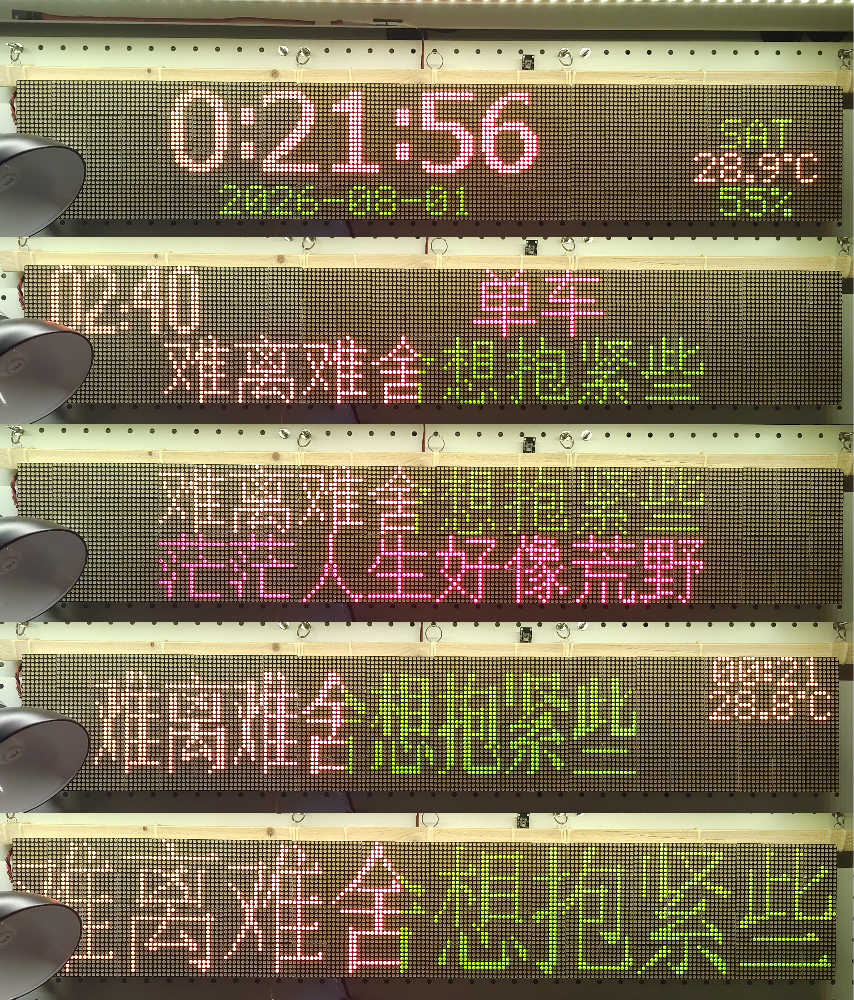
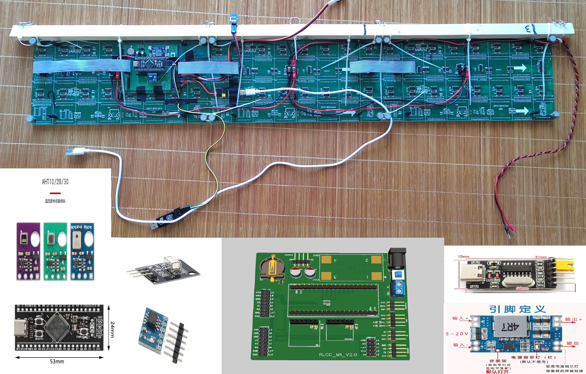

# RLCC_M1

> 📢 **【小作坊爆款声明】**
> 别再看小玩具了！STM32 驱动、超万级灯珠，这才是桌面终极解压神器！
> 192×32 双色阵列（1.2万+ 发光芯片），三屏连拼视效拉满！动态滚动歌词一出，瞬间回到港台金曲黄金时代！

STM32F401 双色 LED 点阵歌词显示屏固件项目。

## 实拍效果



*实时歌词滚动、超大数字时钟、日期显示、AHT30 温湿度监控，复古点阵质感，秒杀一切平庸电子框！*

---

## 硬件与物料清单 (BOM)

### 核心硬件
- **MCU**: STM32F401RCT6 (BlackPill 核心板)
- **屏幕**: 64×32 双色 LED 点阵屏（HUB08 接口，16 扫）×3
- **传感器**: AHT30 温湿度（I2C）

### 灵魂物料大拼图
看看这“野路子”拼贴图，你就知道复刻起来有多简单！不需要复杂的 PCB，全是通用模块，买回来飞线都能动！



*图中展示了原型机的实物飞线连接以及核心模块：BlackPill 核心板、AHT30、红外接收、USB-TTL、DCDC 降压模块、甚至还有我设计的适配器 PCB（选配）。*

## 功能

- **双色歌词显示**：支持红 / 绿 / 黄三色动态渲染与丝滑滚动
- **多界面切换**：支持大数字时钟、日期、温湿度及歌词模式
- **红外遥控**：IR 遥控器一键切换界面与功能
- **串口协议通信**：高效上位机通信协议，实时下发歌词与媒体数据

## 构建

使用 VSCode + ST 官方插件（STM32 VS Code Extension）：
- 打开项目后按 **F7** 即可自动编译构建

## 原型机接线参考

如果你也想“飞线”复刻，请参考以下引脚定义，并对比上面的灵魂 BOM 拼图：

| 接口 | 引脚 | 说明 |
|------|------|------|
| **串口 (USART1)** | PA9 (TX) / PA10 (RX) | 用于上位机下发歌词 (连接 USB-TTL 模块) |
| **I2C1** | PB6 (SCL) / PB7 (SDA) | AHT30 温湿度传感器 |
| **红外 (IR)** | PB8 | 遥控接收 (使用标准的红外接收头模块) |
| **HUB08** | 板载接口 | 192×32 双色点阵屏驱动信号 |

> **⚠️ 注意**：由于 3 块屏并联电流巨大（实测可达 4.7A+），请**务必使用外部 $5\text{V}/\text{5A}+$ 的电源供电**。图中显示的 DCDC 降压模块仅适用于 MCU 和传感器，屏幕必须直连大电流电源。千万别试图用 USB-TTL 或核心板上的 USB 口给屏幕供电，否则必烧！

## 目录结构

```text
├── App/       # 应用层（UI 管理、事件管理、协议解析、歌词服务）
├── Drivers/   # 驱动层（Display 显示驱动、Board 板级驱动）
└── Core/      # CubeMX 生成的启动代码与主循环
```